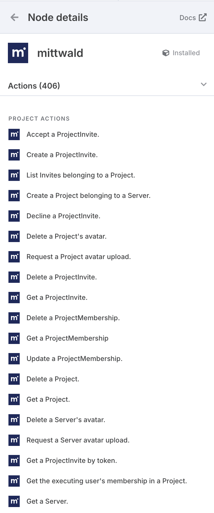
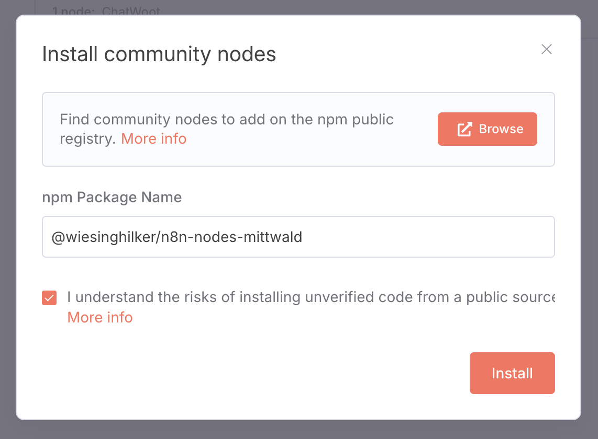

# n8n node for mittwald mStudio API

## Overview

This node enables the integration of the mittwald mStudio API into n8n to directly manage projects and other resources.

## Installation

Add the `@wiesinghilker/n8n-nodes-mittwald` package to your n8n installation:

## Configuration

To use the mittwald API, you need an API token. You can generate this in your mStudio profile. Add the token in the node settings under API token.